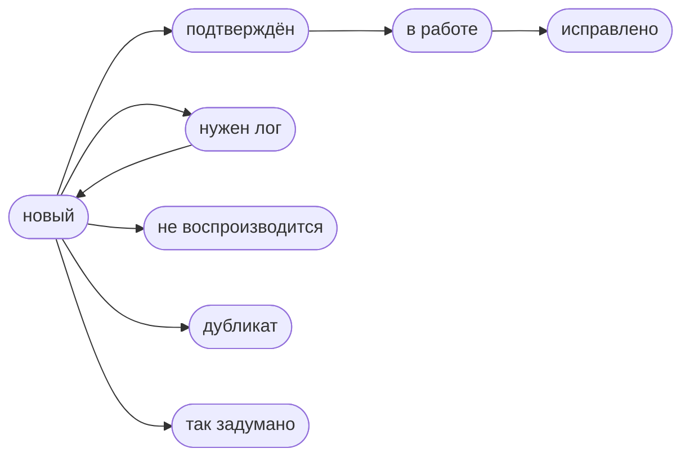

# Hangar Studio

**Ошибки, предложения и вопросы**

[Сообщить об ошибке](https://github.com/kostikmalish/hangar-studio-feedback/issues/new?template=bug.yml) &nbsp;·&nbsp; [Предложить идею](https://github.com/kostikmalish/hangar-studio-feedback/discussions/new?category=ideas) &nbsp;·&nbsp; [Задать вопрос](https://github.com/kostikmalish/hangar-studio-feedback/discussions/new?category=q-a)

---

Hangar Studio — модификация для «Мира Танков» и World of Tanks, которая позволяет сменить ангар или сделать ангаром любую игровую карту. Здесь собираются отчёты об ошибках, предложения и вопросы пользователей. Все обращения публичны: можно найти уже известную проблему, поддержать чужое предложение или подписаться на обновления.

## Куда писать

| Раздел | Назначение | |
|---|---|---|
| **Ошибки** | Мод работает неправильно, вызывает вылет игры или отображается некорректно. | [Сообщить](https://github.com/kostikmalish/hangar-studio-feedback/issues/new?template=bug.yml) · [Список](https://github.com/kostikmalish/hangar-studio-feedback/issues?q=is%3Aissue%20label%3A%D0%B1%D0%B0%D0%B3) |
| **Предложения** | Новые возможности и улучшения. Предложения с наибольшим числом голосов рассматриваются в первую очередь. | [Предложить](https://github.com/kostikmalish/hangar-studio-feedback/discussions/new?category=ideas) · [Список](https://github.com/kostikmalish/hangar-studio-feedback/discussions/categories/ideas) |
| **Вопросы** | Установка, настройка и работа с модом. Ответ, отмеченный как решение, закрепляется в обсуждении. | [Спросить](https://github.com/kostikmalish/hangar-studio-feedback/discussions/new?category=q-a) · [Список](https://github.com/kostikmalish/hangar-studio-feedback/discussions/categories/q-a) |

## Как сообщить об ошибке

1. Убедитесь, что установлена последняя версия мода.
2. Проверьте [список ошибок](https://github.com/kostikmalish/hangar-studio-feedback/issues?q=is%3Aissue%20label%3A%D0%B1%D0%B0%D0%B3). Если проблема уже известна, поддержите её реакцией и нажмите **Subscribe**, чтобы получить уведомление об исправлении.
3. Заполните форму и приложите `python.log`.

> [!NOTE]
> `python.log` находится в корне папки с игрой: рядом с `Tanki.exe` в «Мире Танков» или с `WorldOfTanks.exe` в World of Tanks. Приложите его сразу после ошибки, не запуская игру повторно. Без лога большинство ошибок найти невозможно.

## Поддерживаемые версии

| Клиент | Статус |
|---|---|
| Мир Танков (Lesta Games) | Поддерживается |
| World of Tanks (Wargaming) | Поддерживается |

## Статусы обращений

| Метка | Значение |
|---|---|
| `статус: новый` | Обращение получено и ещё не рассмотрено |
| `статус: нужен лог` | Недостаточно данных, чаще всего не хватает `python.log` |
| `статус: подтверждён` | Ошибка воспроизведена |
| `статус: в работе` | Исправление в процессе |
| `статус: исправлено` | Исправлено, войдёт в следующую версию |
| `статус: не воспроизводится` | Повторить ошибку не удалось, нужны подробности |
| `статус: дубликат` | Ошибка уже описана, ссылка приведена в комментарии |
| `статус: так задумано` | Описанное поведение не является ошибкой |

## Частые вопросы

<b>После установки игра перезапустилась сама</b>

Это ожидаемое поведение. При первом запуске `openwg_gameface` обновляет список ресурсов игры и один раз перезапускает клиент.

<b>Мод не появился в игре</b>

Проверьте, что установлен [openwg_gameface](https://gitlab.com/openwg/wot.gameface/-/releases/) — без него мод не запускается. Файл мода должен находиться в папке `mods/<номер_патча>`.

<b>Где находится кнопка мода</b>

В ангаре, рядом с кнопкой уведомлений, появляется кнопка со списком модификаций — Hangar Studio открывается из неё. Если у вас уже установлен другой мод со списком модификаций, Hangar Studio добавится в него, отдельная кнопка не появится.

<b>Можно ли писать на английском</b>

Да. English is welcome.

## Ссылки

- [Тема мода на форуме](https://forum.tanki.su/topic/2225940-14500-hangarstudio-%E2%80%94-%D0%B2%D1%8B%D0%B1%D0%B8%D1%80%D0%B0%D0%B9-%D1%81%D0%BE%D0%B7%D0%B4%D0%B0%D0%B2%D0%B0%D0%B9-%D0%BD%D0%B0%D1%81%D1%82%D1%80%D0%B0%D0%B8%D0%B2%D0%B0%D0%B9/) — описание и загрузка
- [openwg_gameface](https://gitlab.com/openwg/wot.gameface/-/releases/) — обязательная зависимость

---

Hangar Studio — неофициальная модификация, не связанная с Lesta Games и Wargaming.
